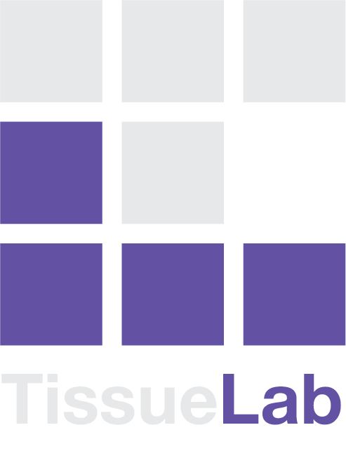

<div align="center">

# TissueLab

**A Co-evolving Agentic AI System for Medical Imaging Analysis**

</div>

<div align="center">

[](https://arxiv.org/abs/2509.20279)
[](LICENSE)
[](https://python.org)

</div>

<br>

<div align="center">
  
</div>

<br>

## 🖥️ YouTube Demonstration Video
- [TissueLab Demonstrations](https://www.youtube.com/watch?v=rssWT4Mehqw) - A demonstration video showcasing TissueLab experimental results and visualizations

## 📄 Research Paper
**Paper**: [A co-evolving agentic AI system for medical imaging analysis](https://arxiv.org/abs/2509.20279) (arXiv:2509.20279)

**Experimental Results and Video Illustrations**: https://github.com/zhihuanglab/TissueLab-Experiment  

## 🔬 Reproducing Our Research Findings

Our paper demonstrates TissueLab co-evolving at three complementary levels — tool, strategy, and slide-level workflow. The integration status in this open-source platform is as follows:

### Integrated and usable today
- **Tool-level co-evolution & the full agent stack** — workflow / entrance / summary agents, customizable tool factories across pathology, radiology, and spatial omics, pixel-level active learning, and one-click model integration are all shipped in the open-source build.

  📹 **Demo video**: [`tutorials/tool_level_coevolving_demo.mp4`](tutorials/tool_level_coevolving_demo.mp4) — how tool-level co-evolution adapts to different disease settings using only the local build (no ecosystem dependencies).

- **Slide-level co-evolution — discovery mode (TL Coscientist)** — the open-ended scientific-discovery agent used in the paper's Alzheimer's disease biomarker experiment on SEA-AD hippocampal slides, where TissueLab autonomously proposed, implemented, and validated interpretable donor-level biomarker panels for continuous memory decline.

  📹 **Demo video**: [`tutorials/tissuelab_research_demo.mp4`](tutorials/tissuelab_research_demo.mp4) — end-to-end walkthrough showing how to drive TL Coscientist in the app.

### Coming soon (integration in progress)
These features run in our lab today but are not yet exposed as a turnkey experience in the open-source build. We are actively wiring the remaining research code into the platform and hardening it for general use:

- **Strategy-level co-evolution** — the self-corrective skill-distillation regime used in the paper's lymph node metastasis (LNCO2) experiment.
- **Slide-level co-evolution — decision-support mode** — the criteria-anchored workflow refinement used in the paper's breast-cancer tubule formation grading experiment, surpassing both human-orchestrated workflows and training-based foundation-model baselines.
- **Per-class patch maps (1-vs-rest patch classification)** — every patch classification experiment in the paper was run in 1-vs-rest mode, training one binary classifier per class so each class has its own dedicated patch map. Integration in progress, coming soon.

### Reproducibility artifacts (scripts + data)
Standalone scripts and the accompanying datasets for the paper's experiments — including AD biomarker discovery, strategy co-evolution (LNCO2), tubule formation grading, and the other clinical-quantification tasks — live in the companion repository **[zhihuanglab/TissueLab-Experiment](https://github.com/zhihuanglab/TissueLab-Experiment)** so that the results can be reproduced without waiting for the full in-app integration to land.

If you need early access for review or collaboration in the meantime, please open an issue or reach out via the contact channels at the bottom.

## 🌟 Abstract

Agentic AI is rapidly advancing in healthcare and biomedical research. However, in medical image analysis, its performance and adoption for research and clinical decision support remain limited due to the lack of continuous learning capabilities in agentic AI systems and the absence of real-time, human-in-the-loop interactive expert feedback. End-to-end vision-language models (VLMs) such as GPT-5.4, trained on image–text alignment, are limited in multi-step quantitative reasoning, and current agentic systems built on fixed toolboxes or VLM dialogues lack mechanisms to iteratively refine their analytical reasoning under expert feedback.

Here we present **TissueLab**, a co-evolving agentic AI system that allows humans to ask direct research questions, automatically orchestrates explainable workflows and invokes tools as needed, and conducts real-time analyses where experts can visualize intermediate results and refine them. TissueLab's ecosystem integrates tool factories spanning pathology, radiology, and spatial omics domains. By standardizing the inputs, outputs, capabilities, and use cases of diverse tools, TissueLab determines when and how to invoke these expert tools to address research and clinical questions.

Through experiments across diverse tasks where clinically meaningful quantifications directly inform staging, prognosis, and treatment planning, we show that TissueLab achieves state-of-the-art performance compared with end-to-end VLMs such as GPT-5.4 and other agentic AI systems. Moreover, the TissueLab ecosystem continuously learns from experts at the **tool, strategy, and workflow levels** — accumulating knowledge from pixel-level feedback, distilling recurring errors into reusable corrective strategies, and iteratively refining slide-level workflows under expert supervision. With transparent multi-level adaptation, it delivers accurate results in previously unseen disease contexts within minutes without requiring massive datasets or prolonged retraining.

In colon cancer, TissueLab reached **94.9% accuracy** in neoplastic cell quantification within 10–30 minutes of feedback with real-time updates, outperforming state-of-the-art VLM baselines. In lymph node metastasis classification, TissueLab autonomously distilled corrective skills from its own errors to improve correlation **from 0.827 to 0.933** without modifying the underlying models. On tubule formation scoring, TissueLab co-evolved its analytical workflow across 20 rounds to reach **macro-AUC 0.838**, surpassing both human-orchestrated workflows and training-based baselines. Released as a sustainable open-source ecosystem, we expect TissueLab to greatly advance and accelerate computational research and translational adoption in medical imaging, while establishing a foundation for transparent and reproducible medical AI infrastructure.

### Key Features
- **🤖 Direct Question-Answering**: Ask natural language questions about medical images
- **⚡ Automatic Workflow Generation**: AI-powered planning and execution of analysis workflows  
- **👁️ Real-time Interactive Analysis**: Visualize intermediate results and refine analyses
- **🔬 Cross-domain Integration**: Pathology, radiology, and spatial omics tools
- **🧠 Continuous Learning**: Evolves with clinician feedback through active learning
- **🌐 Open Source**: Sustainable ecosystem for computational research and clinical adoption

## Pre-requisite - If this is your first time installing TissueLab (otherwise directly jump to **Initialize TissueLab**)

Initialize Git LFS.
If this is your first time using `git-lfs`, please follow this tutorial: https://docs.github.com/en/repositories/working-with-files/managing-large-files/installing-git-large-file-storage.


Step 1. Install electron

Install node.js from ```https://nodejs.org/en/download/``` (use version `v20.16.0`).

On Mac OS or Ubuntu:

1. To download and install [electron](https://electron.atom.io) ( OS X or Linux ) you have to download it from [npm-electron](https://www.npmjs.com/package/electron) using :

   ```
   npm install electron --save-dev
   ```

   ```
   npm install -g electron
   ```

   ( if you don't have npm installed use this [link](https://nodejs.org/en/download/) to download it. )

2. Clone this repository:
   ```
   git clone https://github.com/zhihuanglab/TissueLab.git
   ```

## 🚀 Quick Start

### Prerequisites

- **Node.js** v20.16.0+ ([Download](https://nodejs.org/en/download/))
- **Python** 3.11+ with conda
- **Git LFS** for large file storage
- **NVIDIA GPU** (recommended for AI acceleration)

### 1. Clone and Setup

```bash
# Clone the repository
git clone https://github.com/zhihuanglab/TissueLab.git
cd TissueLab

# Initialize Git LFS
git lfs fetch
git lfs pull
```

### 2. Install Dependencies

```bash
# Install Electron dependencies
cd app
npm install

# Install Frontend dependencies
cd render
npm install
cd ..

# Build the frontend (driven from app/, runs next build + bundles standalone output)
npm run build

# Install Backend dependencies
cd service
conda create -n tissuelab-ai python=3.11
conda activate tissuelab-ai
pip install -r requirements-windows.txt  # Choose your platform: -windows / -macos / -linux
cd ../..
```

### 3. Configure Environment (Optional)

**By default**, TissueLab ships with working configuration that points at our hosted ecosystem services (`ctrl.vlm.ai`). No additional setup needed to run.

Both frontend and backend read a single `.env` file each:

- **Frontend**: `app/render/.env` — endpoints, Firebase Web config, Google OAuth client.
- **Backend**: `app/service/.env` — Firebase project ID, ctrl service endpoint, OpenAI key.

**To point at your own agent / ctrl service**, edit `app/render/.env`:
```bash
PUBLIC_CTRL_SERVICE_HOST=your-agent-host
PUBLIC_CTRL_SERVICE_API_ENDPOINT=https://your-agent-endpoint.com
```

**To use your own OpenAI key**, edit `app/service/.env`:
```bash
OPENAI_API_KEY=your-open-ai-key
```

### 4. Launch TissueLab

Frontend and backend run as separate processes; start each in its own terminal.

```bash
# Terminal 1 — Python backend (port 5001)
cd app
npm run start-backend
# equivalent: cd app/service && conda activate tissuelab-ai && python main.py
```

```bash
# Terminal 2 — Electron + Next.js dev server (frontend on port 3000)
cd app
npm run dev
```

For a production-style launch off the built standalone output (after `npm run build`):
```bash
# Terminal 1 — backend
cd app && npm run start-backend

# Terminal 2 — Electron loading the prebuilt bundle
cd app && npm start
```

## 🏗️ Architecture Overview

TissueLab follows a modern three-tier architecture:

### 🖥️ Desktop Layer (Electron)
- **Cross-platform desktop application**
- **Secure file system access**
- **Native OS integration**
- **Hospital firewall compatibility**

### 🎨 Frontend Layer (Next.js + React)
- **Modern React-based UI**
- **Real-time image visualization**
- **Interactive annotation tools**
- **Responsive design for medical workflows**

### 🧠 Backend Layer (Python + FastAPI)
- **AI model inference engine**
- **Medical image processing**
- **RESTful API services**
- **Microservices architecture**


## 📁 Project Structure

```
TissueLab/
├── app/                           # Main application directory
│   ├── electron/                  # Electron main process
│   │   ├── main.js              # Main entry point
│   │   └── preload.js            # Preload script
│   ├── render/                   # Frontend (Next.js)
│   │   ├── components/           # React components
│   │   ├── pages/               # Next.js pages
│   │   ├── hooks/               # Custom hooks
│   │   ├── services/            # API services
│   │   └── store/               # State management
│   └── service/                  # Backend (Python)
│       ├── app/                  # FastAPI application
│       │   ├── api/             # API endpoints
│       │   ├── services/        # Business logic
│       │   ├── websocket/       # WebSocket handlers
│       │   └── core/            # Core configurations
│       ├── main.py              # Backend entry point
│       └── requirements-*.txt   # Platform dependencies
```

## 🖥️ Electron Desktop Application

### Features
- **Cross-platform support**: Windows, macOS, Linux
- **Native file system access**: Secure handling of medical images
- **Auto-update capability**: Seamless application updates
- **System integration**: Native OS features and notifications


## 🎨 Frontend (Next.js + React)

### Key Technologies
- **Next.js 13+** - React framework with App Router
- **TypeScript** - Type-safe development
- **Tailwind CSS** - Utility-first styling
- **OpenSeadragon** - Medical image viewer
- **Zustand** - State management
- **React Query** - Data fetching and caching


### Environment Configuration

TissueLab uses one `.env` file per side; both ship with sane defaults pointing at our hosted ecosystem.

#### Build Your Own Agent (Frontend)
Edit `app/render/.env`:
```bash
PUBLIC_CTRL_SERVICE_HOST=localhost
PUBLIC_CTRL_SERVICE_API_ENDPOINT=http://localhost:5001
```

#### Custom OpenAI Integration (Backend)
Edit `app/service/.env`:
```bash
OPENAI_API_KEY=your-open-ai-key
```


### Frontend Structure
```
app/render/
├── components/          # Reusable React components
│   ├── Dashboard/       # Main dashboard components
│   ├── ImageViewer/     # Medical image viewer
│   └── ui/              # UI components
├── pages/               # Next.js pages (routes)
│   ├── dashboard.tsx    # Main dashboard
│   ├── imageViewer.tsx  # Image analysis interface
│   ├── community/       # Community workflow gallery
│   ├── study.tsx        # Study browser
│   └── datasets.tsx     # Dataset management
├── hooks/               # Custom React hooks
├── services/            # API service layer
├── store/               # State management
├── utils/               # Utility functions
└── types/               # TypeScript definitions
```


## 🧠 Backend (Python + FastAPI)

### Core Components
- **FastAPI Application**: High-performance async API framework
- **Celery Task Queue**: Distributed background task processing
- **WebSocket Support**: Real-time communication for live updates
- **Microservices Design**: Modular, scalable service architecture
- **AI Model Integration**: Seamless integration with various AI models

### Key Features
- **Real-time Processing**: Live image analysis and feedback
- **Distributed Computing**: Scalable task distribution
- **Model Management**: Dynamic AI model loading and switching
- **Active Learning**: Continuous model improvement
- **Multi-modal Support**: Pathology, radiology, and spatial omics

### Backend Structure
```
app/service/
├── app/                           # Main FastAPI application
│   ├── api/                       # API endpoints
│   │   ├── tasks.py              # Workflow / task orchestration
│   │   ├── seg.py                # Segmentation endpoints
│   │   ├── load.py               # Data loading endpoints
│   │   ├── data.py               # Dataset & file management
│   │   ├── radiology.py          # Radiology (Niivue) endpoints
│   │   ├── review.py             # Review workflow endpoints
│   │   ├── agent.py              # Local LLM / discovery agent
│   │   ├── thumbnail.py          # Thumbnail generation
│   │   ├── activation.py         # TaskNode activation lifecycle
│   │   └── feedback.py           # User feedback endpoints
│   ├── services/                 # Business logic services
│   │   ├── factory/              # AI model factories
│   │   │   ├── nuclei_segmentation.py
│   │   │   ├── tissue_segmentation.py
│   │   │   ├── nuclei_classifier.py
│   │   │   └── wsi_encoder.py
│   │   ├── tasks/                # Task management
│   │   │   ├── task_manager.py
│   │   │   └── task_node.py
│   │   └── prompts/             # AI system prompts
│   ├── websocket/                # WebSocket handlers
│   │   ├── segmentation_consumer.py
│   │   └── thumbnail_consumer.py
│   ├── core/                     # Core configurations
│   ├── middlewares/              # Custom middleware
│   └── utils/                    # Utility functions
├── main.py                       # Application entry point
├── requirements-*.txt            # Platform-specific dependencies
└── storage/                      # Data storage and models
```

### Running the Backend
```bash
# Development mode
cd app/service
conda activate tissuelab-ai
python main.py --dev

# Production mode
python main.py

# With specific port
python main.py --port 5001
```

### API Endpoints
- `/api/tasks` — Workflow orchestration, node registration, classifier I/O
- `/api/seg` — Segmentation requests and result retrieval
- `/api/load` — Image / tile loading
- `/api/data` — Dataset & file metadata
- `/api/radiology` — Volumetric (Niivue) workflows
- `/api/review` — Review / annotation workflow
- `/api/agent` — Local LLM and discovery sessions
- `/api/thumbnail` — Thumbnail generation
- `/api/activation` — TaskNode activation status (SSE)
- `/api/feedback` — User feedback collection
- `/ws` — WebSocket connections (segmentation, thumbnail, presence, atlas, keywords)

## 🔧 Integrate Your Own Model

TissueLab supports seamless integration of custom AI models into our co-evolving agentic AI system. You can train your own models, collect data, and contribute to the ecosystem.

### Model Integration Pipeline

To integrate your custom model, create a FastAPI service with the following endpoints:

#### Required API Endpoints

```python
from fastapi import FastAPI
from pydantic import BaseModel
from typing import Dict, Any, Optional
import asyncio

app = FastAPI()

# 1. Model Initialization
@app.post("/init")
async def init_model(config: Dict[str, Any]):
    """
    Initialize your model with configuration
    Returns: Model instance and metadata
    """
    # Your model initialization logic
    pass

# 2. Input Requirements
@app.get("/read")
async def get_input_requirements():
    """
    Define what inputs your model expects
    Returns: Input schema and requirements
    """
    pass

# 3. Model Execution
@app.post("/execute")
async def execute_model(input_data: Dict[str, Any]):
    """
    Run your model on the provided input
    Returns: Model predictions and results
    """
    # Your model inference logic
    pass

# 4. Progress Tracking (Optional)
@app.get("/progress")
async def get_progress():
    """
    Server-Sent Events for progress tracking
    Returns: Real-time progress updates
    """
    # SSE implementation for progress tracking
    pass
```

### Integration Resources

#### 1. **TissueLab Model Zoo**
Reference implementation and examples:
- **GitHub**: [https://github.com/zhihuanglab/Tissuelab-Model-Zoo](https://github.com/zhihuanglab/Tissuelab-Model-Zoo)
- **Purpose**: See how other models are integrated
- **Examples**: Complete model integration examples

TissueLab uses Zarr as its on-disk container format. The latest Model Zoo is compatible out of the box.

#### 2. **TissueLab SDK**
Pre-built image processing utilities:
- **GitHub**: [https://github.com/zhihuanglab/TissueLab-SDK](https://github.com/zhihuanglab/TissueLab-SDK)
- **Purpose**: Reduce development costs with ready-to-use image processing
- **Features**: Image loading, preprocessing, postprocessing utilities

#### Integration Workflow

##### Step 1: Develop Your Model Service
```bash
# Create your FastAPI service
pip install fastapi uvicorn tissuelab-sdk

# Implement the required endpoints
# Reference: https://github.com/zhihuanglab/Tissuelab-Model-Zoo
```

##### Step 2: Integrate with TissueLab Desktop
1. **Open TissueLab Desktop**
2. **Navigate to Community - Factory**
3. **Click "Add Custom Model"**
4. **Choose your own pipeline**
5. **No coding required for integration - one-click integration!**


#### Walking toward clinical intelligence
- **Use TissueLab's annotation tools** for data labeling
- **Leverage active learning** for efficient data collection
- **Export classifier** in standard formats
- **Contribute to the ecosystem** if you want to share this classifier, everyone can build upon yours, further optimize


## 📢 News

- **Sep 24, 2025**. Our paper *"A co-evolving agentic AI system for medical imaging analysis"* has been published on [arXiv:2509.20279](https://arxiv.org/abs/2509.20279).
- **Sep 29, 2025**. Initial release of the **TissueLab** open-source ecosystem.

## 🤝 Contributing

We welcome contributions from the community! Please see our tutorial for details on how to get started.

## 📜 License

This project is licensed under the Penn Academic Software License — see the [LICENSE](LICENSE) file for terms. Commercial use requires a separate license from the University of Pennsylvania.

## 📞 Contact & Support

- **Paper**: [arXiv:2509.20279](https://arxiv.org/abs/2509.20279)
- **Issues**: [GitHub Issues](https://github.com/zhihuanglab/TissueLab/issues)
- **Discussions**: [GitHub Discussions](https://github.com/zhihuanglab/TissueLab/discussions)

## 🙏 Acknowledgments

We gratefully acknowledge support from our institutions and all contributors. This work represents a collaborative effort to advance medical imaging AI through open-source innovation.

### Institutional Support
- Department of Pathology, University of Pennsylvania
- Department of Electrical and System Engineering, University of Pennsylvania

### Community
- All open-source contributors and the broader medical AI community

### Related Work
This project builds upon and integrates with various open-source medical imaging tools and frameworks. We thank the developers and researchers who have contributed to the broader ecosystem of medical AI tools.

## 📚 Citation

If you use TissueLab in your research, please cite our paper:

```bibtex
@article{li2025co,
  title={A co-evolving agentic AI system for medical imaging analysis},
  author={Li, Songhao and Xu, Jonathan and Bao, Tiancheng and Liu, Yuxuan and Liu, Yuchen and Liu, Yihang and Wang, Lilin and Lei, Wenhui and Wang, Sheng and Xu, Yinuo and Cui, Yan and Yao, Jialu and Koga, Shunsuke and Huang, Zhi},
  journal={arXiv preprint arXiv:2509.20279},
  year={2025}
}
```
