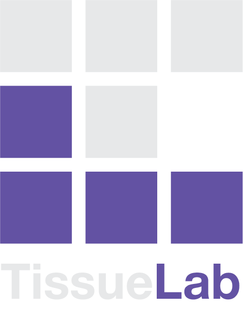

<div align="center">

# TissueLab

**A Co-evolving Agentic AI System for Medical Imaging Analysis**

</div>

<div align="center">

[](https://arxiv.org/abs/2509.20279)
[](LICENSE)
[](https://python.org)
[](https://nodejs.org)

</div>

<br>

<div align="center">
  
</div>

<br>

## 🖥️ Demonstration Videos
- [TissueLab Demonstrations](https://www.youtube.com/watch?v=rssWT4Mehqw) — experimental results and visualizations
- [`tutorials/tool_level_coevolving_demo.mp4`](tutorials/tool_level_coevolving_demo.mp4) — tool-level co-evolution on the local build
- [`tutorials/tissuelab_research_demo.mp4`](tutorials/tissuelab_research_demo.mp4) — driving TL Coscientist in the app

## 📄 Research Paper
**Paper**: [A co-evolving agentic AI system for medical imaging analysis](https://arxiv.org/abs/2509.20279) (arXiv:2509.20279)

**Experimental Results and Video Illustrations**: https://github.com/zhihuanglab/TissueLab-Experiment

## 📦 About This Edition

This is the **self-contained** edition of [TissueLab](https://www.tissuelab.org): the whole application runs on one machine with **one Python service** and **one local user**. It contains everything needed to open whole-slide images and radiology volumes, run segmentation / classification task nodes, train classifiers with pixel-level active learning, plan and execute workflows with the LLM agent, and manage files.

## 🌟 Abstract

Agentic AI is rapidly advancing in healthcare and biomedical research. End-to-end vision-language models (VLM) like GPT-5, trained on image-text alignment, are limited in multi-step quantitative reasoning, and current agentic systems built on fixed toolboxes or VLM dialogues lack mechanisms to refine their analytical reasoning under expert feedback. 

Here we present "TissueLab", a co-evolving agentic AI system that allows humans to ask direct research questions, automatically orchestrates workflow and invokes tools as needed, and conducts analyses where experts can visualize intermediate results and refine them. With transparent multi-level adaptation, it delivers accurate results in unseen disease contexts within minutes without massive datasets or retraining. 

In colon cancer, TissueLab reached **94.9% accuracy** in neoplastic cell quantification within 10-30 minutes of feedback, outperforming VLM baselines. In lymph node metastasis classification, it distilled corrective skills from errors, raising correlation **from 0.827 to 0.933** without modifying the underlying models. On tubule formation scoring, it co-evolved its workflow over 20 rounds to **macro-AUC 0.836**, surpassing human-designed workflows and matching training-based adaptation. Frozen workflows retained these gains on external cohorts across institutions and platforms. 

Released as a publicly available ecosystem, TissueLab can accelerate computational research and translational adoption in medical imaging and provide a foundation for transparent and reproducible medical AI.

### Key Features
- **🤖 Direct Question-Answering**: Ask natural language questions about medical images
- **⚡ Automatic Workflow Generation**: AI-powered planning and execution of analysis workflows
- **👁️ Real-time Interactive Analysis**: Visualize intermediate results and refine analyses
- **🔬 Cross-domain Integration**: Pathology, radiology, and spatial omics tools
- **🧠 Continuous Learning**: Evolves with clinician feedback through active learning
- **🔒 Fully Local**: One service, one local user — no cloud account, no database, no telemetry
- **🌐 Open Source**: Sustainable ecosystem for computational research and clinical adoption

## 🚀 Quick Start

### Prerequisites

- **Node.js** v24+ ([Download](https://nodejs.org/en/download/))
- **Python** 3.11 with conda (or any virtualenv)
- **NVIDIA GPU** recommended for the task nodes (the service itself runs on CPU)
- **Docker** optional — only for sandboxed code execution (`CODEEXEC_DOCKER=1`)

### 1. Clone and Setup

```bash
git clone https://github.com/zhihuanglab/TissueLab.git
cd TissueLab/app

# Electron shell + renderer
npm install
cd render && npm install && cd ..

# Python service
cd service
conda create -n tissuelab python=3.11
conda activate tissuelab
pip install -r requirements-windows.txt   # or requirements-macos.txt / requirements-linux.txt
cp .env.example .env.local                # optional: add OPENAI_API_KEY for the agent
cd ..
```

Slides in `.svs` / `.ndpi` / `.mrxs` and JPEG-2000 TIFFs need a full libvips build:
run `python scripts/fetch_libvips.py` in `app/service` on Windows, `brew install vips`
on macOS.

### 2. Launch TissueLab

Frontend and backend run as separate processes; start each in its own terminal.

```bash
# Terminal 1 — the Python service (http://127.0.0.1:5001)
cd app/service
python main.py
# equivalent from app/: npm run start-backend
```

```bash
# Terminal 2 — desktop app (Electron + Next.js dev server with hot reload)
cd app
npm run dev
```

For a production-style desktop run: `npm run build && npm start`. To use the renderer in a
browser instead of Electron: `cd app/render && npm run dev` and open http://localhost:3000.

`main.py` also takes `--port N`, `--host H` and `--service-root DIR`. The service listens on
`127.0.0.1` only and performs no authentication, so pass `--host 0.0.0.0` only on a network you
trust (see [docs/local-mode.md](docs/local-mode.md)).

### 3. Configure Environment (Optional)

**By default**, TissueLab ships with a working configuration — no additional setup is needed to
run. Both sides read one `.env` file each; anything can be overridden in `.env.local`.

**Backend** — `app/service/.env.local` (copy of `.env.example`, gitignored). The LLM connection (endpoint, API key, model, protocol, and a separate one for the Research panel) can also be set in the app under **Preferences → AI Models** (the gear next to Login): saved to `<service root>/storage/llm_settings.json`, applied immediately, and taking precedence over `.env.local`; a cleared field falls back to it.

| Variable | Purpose |
|----------|---------|
| `OPENAI_API_KEY` | Enables the LLM agent (planning, chat, code generation). Without it the viewer, task nodes, classifiers and workflows still work; agent routes return a clear "not configured" message. Any non-empty value is fine for servers that do not check keys. |
| `OPENAI_BASE_URL` | Any OpenAI-compatible server: vLLM, Ollama, LM Studio, llama.cpp, LiteLLM, SGLang… (e.g. `http://localhost:11434/v1`). |
| `LLM_MODEL` | Model name on that server, used by every role unless overridden. Defaults to `gpt-5.2` on OpenAI. |
| `LLM_API` | `chat` (Chat Completions, the default for any custom base URL) or `responses` (OpenAI's Responses API, the default on api.openai.com). Structured output falls back automatically for servers that reject `json_schema`. |
| `WORKFLOW_MODEL`, `CHAT_MODEL`, `CODE_MODEL`, `RANKING_MODEL`, `OPENAI_MODEL_ROUTER`, `OPENAI_VISION_MODEL` | Per-role model overrides. |
| `TL_SERVICE_ROOT` | Where `storage/` lives (slides, registry, logs). The Electron app sets it to its per-user data folder. |
| `TL_HOST` | Bind address, default `127.0.0.1`. |
| `PUBLIC_DATA_PATH` | Extra read-only data folder shown as `samples/Data`. |
| `TL_BUNDLE_BASE_URL` | HTTPS host for task node bundles (catalog + archives). |
| `CODEEXEC_DOCKER` | `auto` (default), `1` require Docker, `0` in-process subprocess. |

**Frontend** — `app/render/.env` (overridable in `.env.local`):

| Variable | Purpose |
|----------|---------|
| `PUBLIC_AI_SERVICE_API_ENDPOINT`, `PUBLIC_AI_SERVICE_SOCKET_ENDPOINT` | The local service. Defaults `http://127.0.0.1:5001/api` and `ws://127.0.0.1:5001/ws`. |
| `PUBLIC_COMMUNITY_API_ENDPOINT` | The hosted TissueLab community (Ctrl Service) that the Community page browses and publishes to. Default `https://ctrl.vlm.ai/api`. Requires signing in with a TissueLab account. |
| `NEXT_PUBLIC_FIREBASE_*`, `NEXT_PUBLIC_GOOGLE_CLIENT_ID` | Public web-client identifiers of the hosted TissueLab project, used only for the community sign-in (Firebase Auth; Google PKCE flow on the desktop). |

## 🏗️ Architecture Overview

TissueLab follows a three-tier architecture, collapsed into a single local process tree in this
edition:

```
┌───────────────────────────────────────────────────────────────┐
│  Electron main process            app/electron/               │
│  window · file dialogs · task node bundles · service spawn    │
└───────────────────────────┬───────────────────────────────────┘
                            │ IPC / preload bridge
┌───────────────────────────▼───────────────────────────────────┐
│  Next.js renderer                 app/render/        :3000    │
│  React 19 · OpenSeadragon · NiiVue · Zustand + Redux Toolkit  │
└───────────────────────────┬───────────────────────────────────┘
                            │ REST + WebSocket
┌───────────────────────────▼───────────────────────────────────┐
│  TissueLab service            app/service/   127.0.0.1:5001   │
│  slide & volume I/O · tile rendering · segmentation overlays  │
│  classifiers · workflow runtime + task nodes · code sandbox   │
│  LLM agent (/api/agent) · file manager (/api/fm) · profile    │
└───────────────────────────┬───────────────────────────────────┘
                            ▼
              Zarr sidecars + JSON stores on local disk
```

### 🖥️ Desktop Layer (Electron)
- **Cross-platform desktop application**: Windows, macOS, Linux
- **Secure file system access**: native handling of medical images
- **Hospital firewall compatibility**: nothing leaves the machine by default
- **Task node management**: downloads, installs and spawns model environments

### 🎨 Frontend Layer (Next.js + React)
- **Modern React-based UI**
- **Real-time image visualization**
- **Interactive annotation tools**
- **Responsive design for medical workflows**

### 🧠 Backend Layer (Python + FastAPI)
- **Medical image processing** and tile rendering
- **Workflow runtime** driving task nodes in separate conda environments
- **RESTful API + WebSocket services** for live updates
- **Local LLM agent** for planning, chat and code generation
- **Active learning** for continuous classifier improvement

The service folds in the parts of the hosted control plane a local installation needs — the
LLM agent, the file manager and a local profile. Workflow history, feedback preferences and
the agent's learned corrections are JSON documents under `app/service/storage/users/local/`.

## 📁 Project Structure

```
TissueLab/
├── app/
│   ├── electron/            # Electron main process, preload bridge, task node helpers
│   ├── render/              # Next.js renderer (pages router)
│   │   ├── components/      # React components (dashboard, imageViewer, community, ui)
│   │   ├── pages/           # dashboard.tsx · imageViewer.tsx · community.tsx
│   │   │                    # datasets.tsx · profile/ · legal.tsx
│   │   ├── hooks/           # Custom React hooks
│   │   ├── services/        # API service layer
│   │   ├── store/           # State management
│   │   ├── utils/           # Utility functions
│   │   └── types/           # TypeScript definitions
│   └── service/             # Python service (FastAPI)
│       ├── main.py          # entry point: python main.py [--port N] [--host H] [--service-root DIR]
│       ├── app/api/         # routes: tasks, load, seg, data, thumbnail, radiology, review,
│       │                    #         activation, feedback, history, agent, file_manager, users
│       ├── app/services/    # slide I/O, segmentation, workflow runtime, code sandbox,
│       │                    #         agent/, file_manager/, users
│       ├── app/core/        # settings, identity, access guards, response envelope
│       ├── app/config/      # path_config (storage roots + ACL), zarr layout
│       └── scripts/         # maintenance scripts
├── docs/                    # local-mode.md
├── tests/                   # backend, frontend unit/e2e, smoke
└── tutorials/               # local demo videos
```

## 🔌 API Endpoints
- `/api/tasks` — Workflow orchestration, node registration, classifier I/O
- `/api/seg` — Segmentation requests and result retrieval
- `/api/load` — Image / tile loading
- `/api/data` — Dataset & file metadata
- `/api/radiology` — Volumetric (NiiVue) workflows
- `/api/review` — Review / annotation workflow
- `/api/activation` — TaskNode activation status (SSE)
- `/api/thumbnail` — Thumbnail generation
- `/api/feedback` — Feedback preferences
- `/api/workflow_history` — Workflow history
- `/api/agent` — Local LLM agent and discovery sessions
- `/api/fm` — File manager
- `/api/users` — Local profile
- `/ws` — WebSocket connections (segmentation, thumbnail, presence, atlas, keywords)

## 🧩 Task Nodes

Model inference runs in separate conda environments ("task nodes") spawned by the service.
Install them from the **Models** page in the app (pre-built bundles for Windows and macOS, or
register a custom node pointing at a conda environment), or follow the
[Tissuelab-Model-Zoo](https://github.com/zhihuanglab/Tissuelab-Model-Zoo).

## 🔧 Integrate Your Own Model

TissueLab supports seamless integration of custom AI models into our co-evolving agentic AI
system. You can train your own models, collect data, and contribute to the ecosystem.

### Model Integration Pipeline

To integrate your custom model, create a FastAPI service with the following endpoints:

#### Required API Endpoints

```python
from fastapi import FastAPI
from pydantic import BaseModel
from typing import Dict, Any, Optional
import asyncio

app = FastAPI()

# 1. Model Initialization
@app.post("/init")
async def init_model(config: Dict[str, Any]):
    """
    Initialize your model with configuration
    Returns: Model instance and metadata
    """
    # Your model initialization logic
    pass

# 2. Input Requirements
@app.get("/read")
async def get_input_requirements():
    """
    Define what inputs your model expects
    Returns: Input schema and requirements
    """
    pass

# 3. Model Execution
@app.post("/execute")
async def execute_model(input_data: Dict[str, Any]):
    """
    Run your model on the provided input
    Returns: Model predictions and results
    """
    # Your model inference logic
    pass

# 4. Progress Tracking (Optional)
@app.get("/progress")
async def get_progress():
    """
    Server-Sent Events for progress tracking
    Returns: Real-time progress updates
    """
    # SSE implementation for progress tracking
    pass
```

### Integration Resources

#### 1. **TissueLab Model Zoo**
Reference implementation and examples:
- **GitHub**: [https://github.com/zhihuanglab/Tissuelab-Model-Zoo](https://github.com/zhihuanglab/Tissuelab-Model-Zoo)
- **Purpose**: See how other models are integrated
- **Examples**: Complete model integration examples

TissueLab uses Zarr as its on-disk container format. The latest Model Zoo is compatible out of the box.

#### 2. **TissueLab SDK**
Pre-built image processing utilities:
- **GitHub**: [https://github.com/zhihuanglab/TissueLab-SDK](https://github.com/zhihuanglab/TissueLab-SDK)
- **Purpose**: Reduce development costs with ready-to-use image processing
- **Features**: Image loading, preprocessing, postprocessing utilities

#### Integration Workflow

##### Step 1: Develop Your Model Service
```bash
# Create your FastAPI service
pip install fastapi uvicorn tissuelab-sdk

# Implement the required endpoints
# Reference: https://github.com/zhihuanglab/Tissuelab-Model-Zoo
```

##### Step 2: Integrate with TissueLab Desktop
1. **Open TissueLab Desktop**
2. **Navigate to Community - Factory**
3. **Click "Add Custom Model"**
4. **Choose your own pipeline**
5. **No coding required for integration - one-click integration!**

#### Walking toward clinical intelligence
- **Use TissueLab's annotation tools** for data labeling
- **Leverage active learning** for efficient data collection
- **Export classifier** in standard formats
- **Contribute to the ecosystem** if you want to share this classifier, everyone can build upon yours, further optimize

## 📦 Building Installers

The desktop app bundles a frozen copy of the Python service. Freeze it first, from a **clean**
environment — the service performs no model inference, so the deep-learning stack (torch,
transformers, …) belongs to the task node environments and must not be on the packaging
interpreter (the spec excludes it as a safety net):

```bash
conda create -n tissuelab-pack python=3.11 && conda activate tissuelab-pack
cd app/service
pip install -r requirements-packaging.txt pyinstaller
python scripts/fetch_libvips.py                          # Windows: the libvips DLLs the spec bundles
                                                         # macOS: `brew install vips` instead — main_macos.spec
                                                         # ships that dylib and its modules under _internal/lib/
pyinstaller --noconfirm --clean main_windows.spec        # or main_macos.spec → dist/TissueLab_AI/
```

Then build the shell:

```bash
cp -r app/service/dist/TissueLab_AI app/electron/assets/TissueLab_AI
cd app
npm run build          # renderer → render/.next/standalone
npm run dist:win       # dist/TissueLab-Setup-<version>.exe + dist/win-unpacked/
npm run dist:mac       # DMG
```

An installed app takes the LLM settings from **Preferences → AI Models**, or reads `OPENAI_API_KEY` and the other settings from `<service root>/.env.local`
(`%APPDATA%\TissueLab\.env.local` on Windows,
`~/Library/Application Support/TissueLab/.env.local` on macOS); see `app/service/.env.example`.

## 📢 News

- **Sep 24, 2025**. Our paper *"A co-evolving agentic AI system for medical imaging analysis"* has been published on [arXiv:2509.20279](https://arxiv.org/abs/2509.20279).
- **Sep 29, 2025**. Initial release of the **TissueLab** open-source ecosystem.

## 🤝 Contributing

We welcome contributions from the community. Please open a GitHub Issue to report bugs or discuss a change before sending a pull request.

## 📜 License

This project is licensed under the Penn Academic Software License — see the [LICENSE](LICENSE)
file for terms. Commercial use requires a separate license from the University of Pennsylvania.

## 📞 Contact & Support

- **Paper**: [arXiv:2509.20279](https://arxiv.org/abs/2509.20279)
- **Issues**: [GitHub Issues](https://github.com/zhihuanglab/TissueLab/issues)

## 🙏 Acknowledgments

We gratefully acknowledge support from our institutions and all contributors. This work represents a collaborative effort to advance medical imaging AI through open-source innovation.

### Institutional Support
- Department of Pathology, University of Pennsylvania
- Department of Electrical and System Engineering, University of Pennsylvania

### Community
- All open-source contributors and the broader medical AI community

### Related Work
This project builds upon and integrates with various open-source medical imaging tools and frameworks. We thank the developers and researchers who have contributed to the broader ecosystem of medical AI tools.

## 📚 Citation

If you use TissueLab in your research, please cite our paper:

```bibtex
@article{li2025co,
  title={A co-evolving agentic AI system for medical imaging analysis},
  author={Li, Songhao and Xu, Jonathan and Bao, Tiancheng and Liu, Yuxuan and Liu, Yuchen and Liu, Yihang and Wang, Lilin and Lei, Wenhui and Wang, Sheng and Xu, Yinuo and Cui, Yan and Yao, Jialu and Koga, Shunsuke and Huang, Zhi},
  journal={arXiv preprint arXiv:2509.20279},
  year={2025}
}
```
